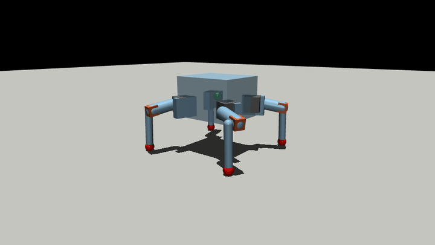

# CubeBot

A 12-DOF sprawled quadruped, simulated in MuJoCo and sized against the servos
it will actually be built with.



*Crawl gait, 0.9 Hz. Physics, contacts and real servo torque/speed limits — not
a kinematic playback.*

## Quick start

```bash
pip install mujoco
cd sim
python view.py            # mjpython view.py on macOS
python view.py --wiggle   # random policy across all 12 joints
```

`sim/cubebot.xml` is a complete MuJoCo model using **primitive geoms only — no
mesh files required**. `sim/cubebot.urdf` is the same robot for ROS and other
tools, generated from the MJCF with matching masses and inertias.

## The robot

| | |
|---|---|
| DOF | 12 (4 legs × yaw / pitch / knee) + free base |
| mass | 751.7 g |
| stand height | 100 mm on four feet |
| walking | ~4 cm/s at 1.0 Hz crawl |
| timestep | 2 ms, `implicitfast` (MJX-compatible) |
| sensors | trunk framequat / gyro / accelerometer / velocimeter, 4× foot touch |

Femur 48.00 mm, tibia 78.82 mm, leg reach 126.82 mm, foot ball r 8.5 mm.

Leg splay is **FL +23.83°, FR −23.83°, BL +106.23°, BR −106.23°**. The rear pair
is *not* a mirror of the front — a naively mirrored rig will produce subtly
wrong angles everywhere.

## Servos

Rated at 4.8 V throughout, which is the conservative column.

| joint | servo | stall | speed |
|---|---|---|---|
| yaw | TowerPro SG90 | 1.8 kg·cm (0.1765 N·m) | 0.10 s/60° |
| pitch, knee | TowerPro SG92R | 2.5 kg·cm (0.2452 N·m) | 0.10 s/60° |

Modelled as position actuators with `kp = stall / 8°` and
`kv = stall / no_load_speed`, forcerange clamped at stall — so a joint asked for
more than the hardware can give **lags** rather than magically delivering it.

Validated across standing, squatting, ±16° body pitch, ±14° roll, all four
tripod stances, walking at 0.8 and 1.0 Hz, and a 144 mm wall-climb pose:

| joint | worst | RMS | saturated |
|---|---|---|---|
| yaw | 74–84% | 14% | **0** |
| pitch | 80–87% | 31% | **0** |
| knee | 64–74% | 12% | **0** |

Nothing saturates in any case tested.

## Things that turned out to be counter-intuitive

**Walking loads the shoulder; climbing loads the knee.** Sizing for one leaves
you short on the other. The knee peaks at 74% walking but needs 0.205 N·m with a
foot planted on a 144 mm wall — which an MG90S (1.8 kg·cm) cannot deliver at all.

**Slower is worse.** Shoulder load is static-hold dominated, so dropping the
gait from 1.0 Hz to 0.8 Hz *raises* the RMS torque and covers less ground. Run
it at 1.0 Hz.

**A bigger servo is not the answer.** An MG996R has 5× the torque but half the
speed, four times the mass, and its 19.7 mm body does not fit a 15.0 mm hip
bracket or a 15.5 mm femur. Fitting one to the knee roughly doubles shoulder
swing inertia.

**Walls beat infill for the leg.** In bending, stress lives at the outer fibres
and infill sits at the neutral axis. Going 3→5 perimeters buys 21% stiffness;
going 15%→40% infill buys 4%.

See [`docs/LEG_TORQUE_MATH.md`](docs/LEG_TORQUE_MATH.md) for the derivations and
how each was validated.

## Layout

```
sim/     cubebot.xml, cubebot.urdf, view.py
cad/     stl-real/            the actual printable parts
         stl-collision-proxies/   URDF stand-ins — see DO_NOT_PRINT.txt
         urdf-original/       original export — see MASSES_ARE_FAKE.txt
docs/    leg statics, fastener census, handoff, params
tools/   sim, joint-control panel, gait generator, mass model, audits
data/    recorded takes and poses
media/   gait and climb renders
```

## Known limitations

**Mass is now measured.** Printed parts weighed ~300 g including support;
backing out ~15% support gives ~255 g of parts and a **~735 g robot**. The model
here runs at 751.7 g — at or slightly above reality, so the validated loads are
mildly conservative. Effective print fill is ~0.55, not the 0.85 first assumed.

**Trunk component positions are an assumed layout.** The mass model is real —
30 components parallel-axis'd into a proper inertia tensor, with the CoM 11.5 mm
below the case centre because the 18650 cells sit low — but *where* each item
sits inside the case is a sensible guess, not CAD.

**The URDF has no floating base.** Standard for URDF: the root link welds to the
world, so a loader reports only the leg mass until you add a free-flyer joint.
The MJCF has a proper free joint.

**Three files in `cad/stl-collision-proxies/` are not real parts** — two solid
slabs and a 12-triangle cuboid, stored in metres. Print from `cad/stl-real/`.

**`legstudy/stairs.py` (not shipped here) is unvalidated** and disagrees with
every other result; a hand-scripted climb through it failed at every height for
trajectory reasons, not physical ones.
